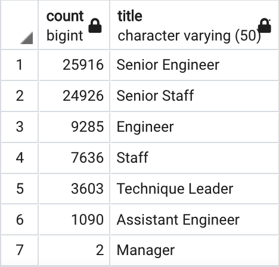

# Pewlett-Hackard-Analysis

## Overview
Our analysis consisted of reviewing several datasets from Pewlett Hackard Corp consisting of thousands of employee recrods to help the Company determine risks regarding stafifng, namely assessing the amount of employees expected to retire in the next few years. The Company hopes to use this data to help it navigate the transition of its workforce to a younger generation as much of its base is expected to retire.  Specifically, management requested information from a database listing the number of retiring employees by title and infromation about which employees would be eligible to participate in the Company's mentorship program. In order to facilitate this request, we were adidtionally tasked with organizing employee data into a database using standard query language (SQL). 

The data was originally given in six coma seperated value (CSV) files consisting of employee information such as hire date, birth date, name, employee number, current position, and salary.  the files also contained organizational data such as department numbers, department names, and titles. These fix files were added into six tables within a SQL database using PG Admin, a PostgreSQL tool. See the figure below for a diagram of the tables, the variables they contain, and the relationships between the tables.  Emp_no was used as a primary key for four of the tables while dept_no was used as the key value for the two orginizational tables. 

 

Once the data from the CSV files were imported into SQL tables, we then created a new table for our first list. This table used employee number, first name, and last name from one table and title and dates indicating when the position was held from another table. It was therefore neccessary to join the two tables to get the desired columns using an inner join where employee number was the primary key. The data was then filtered by using a range of birth dates for employees of eligible retirement age and for positions that are currently held by each employee. It was neccessary to filter by current postiion as many employees have held several positions at the Company during their employment. The data was finally sorted in ascending order on employee number. A second table was generated counting the number of employees for each title at the Company.  Images of the newly generated tables can be seen below. 

 
 

A table was also generated using the employee number, first and last name, birth date, dates at their position, and their title. Much like the previous table, the table was filtered to only contain entries for employees eligible to retire and what their current position title.  These data were also compiled from three seperate tables which all needed to be joined together using employee number as the primary key. The data was then sorted by employee number in ascending order. An image of the data can be seen below. 

 

## Results

- **Senior Engineer** will have the most need for hiring purposes with 25,916 emploees eligible for retirement.
- **Senior Engineer** and **Senior Staff** together consitute approximately 70.5% of total employees eligible for retirement and should be the focus of recruitment efforts. 
- **Management** has the lowest employee count of all titles. 
- there are **1,549** employees eligible for the Company's mentorship program. 

## Summary
Overall, approximately 72,000 employees of retirement age and could retire imminently from the Company meanwhile only 1,500 or so employees are qualified to mentor future employees. Given the above, it seems unliekly that the Company will be able to provide sufficient mentorship to incoming employees filling vacancies left by retiring employees. Unless mentorship program eligibility materially increases in a short period of time, the Comapny should be sure that it allocates the most of its limited resources to the most critical positions and invest into enterprise-level traning and mentorship programs. The Company may also need to rely on external hiring, as opposed to internal promotion to fill coming position vacancies.  

Additionally, further information should be gathered and analyzed as outlined below:
- Queries and tables should be generated describing the relative proportion (%) of imminent retirees by depertment to determnine which department is at the most risk from a mass retirement event. 
- Mentorship eligibility should improved and expanded through the removal of age as a qualification and rather solely rely on the length of time an employee has held thier position. Following management's determination of the qualification term, a new table of data can be generated for all employees who have been at their current position for a period of greater-than or equal-to the required term. 

